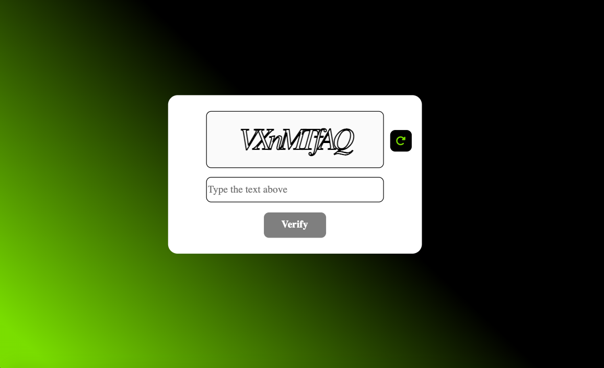

# Captcha Generator App 

This is a simple web application based on my own design that generates and verifies captchas using vanilla JavaScript.

### Overview

The Captcha Generator App is designed to provide a basic example of how captchas can be generated and verified using JavaScript. Captchas are used to distinguish between human users and bots, and they often involve tasks that are easy for humans but difficult for automated scripts.

This app allows users to generate a random captcha text, and then they need to type the exact text into an input field to verify their humanity. The app compares the entered text with the generated captcha and displays an alert indicating whether the entered captcha is correct or not.

### Link

- Live preview: [https://captcha-generator-basiakedz.netlify.app/](https://captcha-generator-basiakedz.netlify.app/)

### Built with

- HTML: Structuring the app's user interface.
- CSS: Styling the app's appearance.
- Vanilla JavaScript: Handling captcha generation, user input, and verification.

### How to Use

1. Clone this repository to your local machine.
2. Open the `index.html` file in a web browser.
3. Click the "Reload" button to generate a new captcha.
4. Enter the captcha text into the input field.
5. Either click the "Verify" button or press "Enter" to check your captcha.

